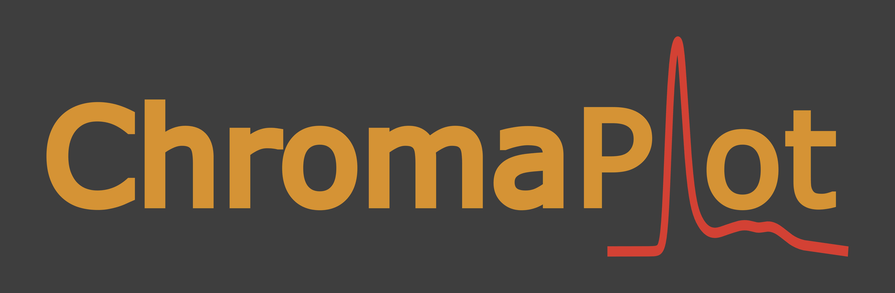

# 

**ChromaPlot** is a Python desktop application designed for creating high-quality figures of chromatogram data from Cytiva ÄKTA systems. It provides an easy-to-use interface for visualising and analysing your chromatographic data.

## Features

- **Single Mode**: Generate plots of single datasets with customisable options for adding/removing instrument traces, changing line styles, colours, adding shaded areas, and more.
- **Overlay Mode**: Compare multiple datasets by overlaying them on the same plot, with full customisation of each trace. Particularly suited to analytical size-exclusion chromatograms.
- **Analysis**: You can currently add a vertical marker to your plots to measure values at specific curve positions. This a work in progress, and other analytical tools will be added in the future.

A guide on how to use the features of ChromaPlot is provided within the app, however if you have any questions or need help, please [contact us](#support--contact-information)

## Installation

ChromaPlot is not officially code-signed by either Windows or Apple, so running from the source code is currently the preferred option.

However, pre-packaged installations are provided for both operating systems for ease of use, allowing you to run the software without needing to install Python and the necessary dependencies on your system.

**Please note:** Installing the pre-packaged versions requires a few extra steps to bypass built-in security warnings from Windows and macOS. These steps are explained below.

If you have any questions or encounter issues, please [contact us](#support--contact-information).

To install ChromaPlot, follow these steps:

### For Windows:

1. Download the `ChromaPlot_windows.zip` file from the latest relesae in the [releases](https://github.com/beh22/ChromaPlot/releases) section.
2. In **Downloads**, unzip the file and enter the folder created
3. Open the `.exe` file, run the installer and follow the on-screen instructions.
4. If you see a warning from Windows Defeder SmartScreen, follow these steps:
   - Click on "More info" in the warning dialog.
   - Click the "Run anyway" buton to proceed with the installation
5. Once installed, you can start ChromaPlot from the Start Menu or desktop shortcut.

<details>
   <summary><b>Information for Windows Users</b></summary>

Because ChromaPlot is not signed with a code-signing certificate from a trusted Certificate Authority, you may encounter a Windows Defender SmartScreen warning when you try to run the application.

**Disclaimer**: We have taken steps to ensure that ChromaPlot is safe and secure. The app is not signed with a code-signing certificate, but you can inspect the source code in this repository or run it directly from the source if you prefer.

**Why This Happens**: Windows Defender SmartScreen warns users when apps from unknown publishers are run. Code-signing certificates bypass this warning but obtaining one can be costly for open-source projects like ChromaPlot.

</details>

### For macOS:

1. Download the `.dmg` file from the latest release in the [releases](https://github.com/beh22/ChromaPlot/releases) section.
2. Open the `.dmg` file and drag the ChromaPlot icon to your Applications folder.
3. Attempt to open the app by double-clicking it.
4. If you see a warning stating that the app is from an unidentified developer, follow these steps:
   - Go to **System Preferences** > **Security & Privacy** > **Security**.
   - Click the "Open Anyway" button near the message about ChromaPlot and type in your password.
   - Confirm that you want to open the app in the dialog box that appears.
5. Open ChromaPlot from the Application folder or Launchpad
   - **Note**: It may require multiple attempts to open the app until it can be used

<details>
   <summary><b>Information for macOS Users</b></summary>

Since ChromaPlot is not signed with an Apple-issued certificate, you may encounter a warning when attempting to open the application. This is because Apple cannot verify that the app is from a trusted developer.

**Disclaimer**: We have ensured that ChromaPlot is safe, though it has not been officially notarized by Apple. You can review the source code in this repository or run the app from the source code.

**Why This Happens**: Apple's Gatekeeper security system prevents apps from unidentified developers from running by default. Notarizing an app requires a paid Apple Developer account, which is not feasible for all open-source projects.

</details>

### From Source:

If prefered, you can run ChromaPlot from the source code. This requires a [Python installation](https://www.python.org/downloads/) on your system. Run the following commands in a termainal:

1. Clone this repository:
   ```bash
   git clone https://github.com/beh22/ChromaPlot.git
   ```
2. Navigate to the project directory:
   ```bash
   cd ChromaPlot
   ```
3. Install the required dependencies:
   ```bash
   pip install -r requirements.txt
   ```
4. Run the application:
   ```bash
   python run_chromaplot.py
   ```

## Updating ChromaPlot

ChromaPlot will automatically check for updates each time it is launched. If a new version is available, you will be prompted to update and taken to the [releases](https://github.com/beh22/ChromaPlot/releases) page to download the latest update. Download the latest version as described above and when prompted, choose to 'Replace' the existing install.

## Acknowledgements

We hope that ChromaPlot makes it easier to create high-quality chromatogram figures. While it is not required, if you use ChromaPlot to generate figures for reports, publications, presentations, or other publicly shared works, we would greatly appreciate a mention or acknowledgement.

**How to Acknowledge ChromaPlot**:

- You could include a simple statement in your figure legend or acknowledgements section, such as:
  - "Figures generated using ChromaPlot (Version X.X.X)."
  - We acknowledge the use of ChromaPlot (Version X.X.X) for generating chromatogram figures."

By including this, you help spread the word about ChromaPlot which would be much appreciated!

## Contributing

Contributions are welcome! If you'd like to contribute to ChromaPlot, please follow these steps:

1. Fork this repository.
2. Create a new branch:
   ```bash
   git checkout -b feature-branch-name
   ```
3. Make your changes and commit them:
   ```bash
   git commit -m "Description of changes"
   ```
4. Push to your fork:
   ```bash
   git push origin feature-branch-name
   ```
5. Create a pull request, and we'll review your changes.

## Licensing and Copyright

This repository contains the source code for ChromaPlot, which is licensed under the [MIT License](LICENSE). You are free to use, modify, and distribute the source code under the terms of this license.

**Note**: The ChromaPlot executable, branding, and logos are copyrighted and are not covered by the open-source license. The use of these elements is restricted and may require a separate license.

If you wish to use the ChromaPlot executable, branding, or logos beyond personal use, please contact us to discuss licensing options.

### Copyright Notices

- **Source Code:** Copyright notices are included at the top of each source code file.
- **Application:** Copyright information is available in the "About" section of the application.
- **Logo:** The ChromaPlot logo is copyrighted and should not be used without permission.

For more information on licensing and usage, please [contact us](#support--contact-information).

## Support / Contact Information

### 1. **Reporting Issues**

- If you encounter and bugs, issues, or have feature requests, please report them on the [GitHub Issues](https://github.com/beh22/ChromaPlot/issues) page. Make sure to provide as much detail as possible, including:
  - Steps to reproduce the issue
  - Screenshots, if applicable
  - The version of ChromaPlot you are using
  - You operating system

### 2. **Contact**

- If you need to reach out directly for support or have any inquiries, feel free to contact us:
  - **Billy Hobbs**: [billyehobbs@gmail.com](mailto:billyehobbs@gmail.com)
  - When contacting via email, please include "ChromaPlot" in the subject line

We aim to respond to issues and inquiries within 48 hours.
